# Creating an EMR instance with JupyterHub

> JupyterHub is an officially supported application on Amazon’s EMR
> (version 5.14.0 and above). A user can create a EMR cluster with
> JupyterHub installed to access JupyterHub on his/her web browser. The
> JupyterHub server enables user(s) to create, view, and edit Jupyter
> notebooks. Full guide here:
> <https://docs.aws.amazon.com/emr/latest/ReleaseGuide/emr-jupyterhub.html>

22. Sign in to the AWS Management Console:
    <https://141650580409.signin.aws.amazon.com/console>

23. Navigate to the EMR console: <https://console.aws.amazon.com/emr/>
    or click below:

> 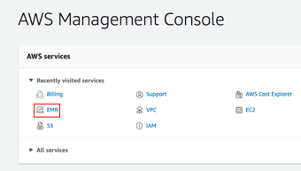

24. Choose **Create cluster**

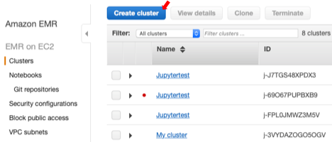

25. Select **Go to** **advanced options**.

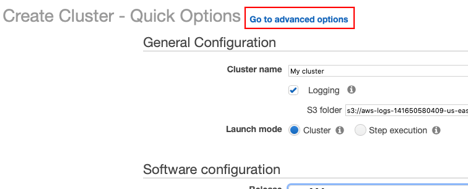

26. Under Software Configuration, for Release, select any of the latest
    versions (emr-5.14.0 and above), and choose **JupyterHub**, along
    with other software that you need:

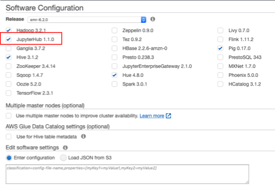

27. \[Optional\]: If you use Spark or Hive, to use the **AWS Glue Data
    Catalog** as the metastore for Spark SQL, select Use for Spark.Hive
    table metadata. For more information, see
    <https://docs.aws.amazon.com/emr/latest/ReleaseGuide/emr-spark-glue.html>
    and
    <https://docs.aws.amazon.com/emr/latest/ReleaseGuide/emr-hive-metastore-glue.html>

28. You can customize the configuration of JupyterHub on Amazon EMR and
    individual user notebooks by editing the configuration or loading a
    JSON file from S3 under **Edit software settings**.

**Important example**: you can configure a JupyterHub cluster in Amazon
EMR so that notebooks saved by a user persist in Amazon S3, outside of
ephemeral storage on cluster EC2 instances:
<https://docs.aws.amazon.com/emr/latest/ReleaseGuide/emr-jupyterhub-s3.html>

> \[
>
> {
>
> "Classification": "jupyter-s3-conf",
>
> "Properties": {
>
> "s3.persistence.enabled": "true",
>
> "s3.persistence.bucket": "testbucketjean030521"
>
> }
>
> }
>
> \]

Notebooks for each user are saved to a **jupyter/jupyterhub-user-name**
folder in the specified bucket. When you launch a new cluster using the
same configuration classification properties, users can open notebooks
with the content from the saved location.

29. Under Steps (optional), configure steps to run when the cluster is
    created. Make sure **Cluster enters waiting state** is selected
    instead of Cluster auto-terminates. Then, choose Next.

30. Choose **Hardware Configuration** options. For more information, see
    <https://docs.aws.amazon.com/emr/latest/ManagementGuide/emr-plan-instances.html>

31. Choose options for **General Cluster Settings**. Here you can change
    the cluster name, and specify the S3 bucket and folder where log
    files should be stored.

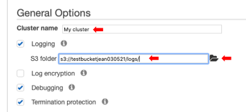

32. Under **Security Options**, specify your key pair, and choose Create
    Cluster.

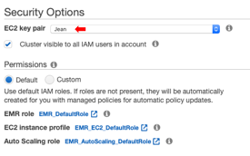

33. Under **Security Options**, specify your key pair, and choose Create
    Cluster.

34. Your cluster will start and will be ready once the status changes to
    “Waiting” (\~15 mins):

    1.  #  Set up a SSH connection to the master node

> You can connect to the Amazon EMR master node using SSH to run
> interactive queries, examine log files, submit Linux commands, and so
> on.

1.  Inbound SSH traffic from port 22 must be authorized before any
    connection to an Amazon EMR cluster. You can check whether inbound
    SSH traffic is authorized by going to the “**Block public access**”
    tab and checking whether **port 22** is in the Exceptions list.

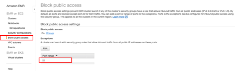

If inbound SSH traffic is not authorized, you can edit the
authorizations if you are a root user by following the instructions
below. Else, contact an administrator:

<https://docs.aws.amazon.com/emr/latest/ManagementGuide/emr-connect-ssh-prereqs.html>

2.  Click on “**Connect to the Master Node**” using SSH for instructions
    in a popup window:

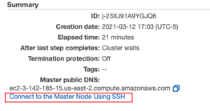

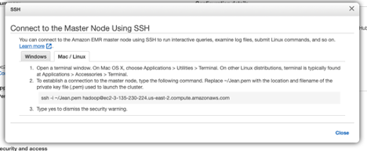

3.  A typical command looks like this (the address changes with each
    loaded instance):

ssh -i keypairname.pem
<hadoop@ec2-3-142-185-15.us-east-2.compute.amazonaws.com>

4.  Run the command and type **yes** to respond to the prompt on the
    ECDSA key fingerprint:

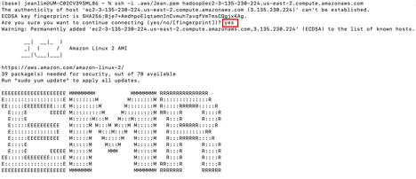

#  Access JupyterHub (and other user interfaces) from your web browser

1.  First, set up a SSH tunnel to the master node using dynamic port
    forwarding:

ssh -i Jean.pem -N -D 8157
<hadoop@ec2-3-142-185-15.us-east-2.compute.amazonaws.com>

> This example command accesses the ResourceManager web interface by
> forwarding traffic on local port **8157** (a randomly chosen unused
> local port) to the master node's local web server. Replace the DNS
> name (ec2-xxxx.compute.amazonaws.com) with that of your cluster
> accordingly. **You will not get any response after executing this
> command, but keep the SSH client window open to maintain the tunnel.**
>
> Full instructions at:
> <https://docs.aws.amazon.com/emr/latest/ManagementGuide/emr-ssh-tunnel-local.html>

2.  Use a Firefox or Chrome SOCKS proxy management add-on to control the
    proxy settings in your browser:
    <https://docs.aws.amazon.com/emr/latest/ManagementGuide/emr-connect-master-node-proxy.html>

**Note**: The Mozilla Firefox instructions worked for me but not Chrome.
Follow the steps above and change **browserVersion** and
**foxyProxyversion** accordingly in the JSON file.

You will receive a security warning on your web browser when you open up
the interface, click “Advanced..” and “Accept the Risk and Continue”:

3.  Go to the **Application user interfaces** tab. Now, you can access
    any of the user interfaces by copying and pasting the relevant URL
    in your Firefox or Chrome browser:

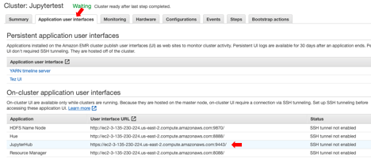

For JupyterHub, the port is 9443, e.g.
<https://ec2-xxx.compute.amazonaws.com:9443/>

4.  Once you open up the JupyterHub interface in your browser, you will
    be required to login. These are the generic credentials for AWS:

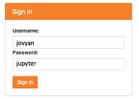

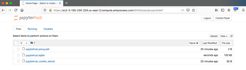

5.  You can create a new Jupyter user (e.g. diego) with the password
    (e.g. password) on the master node with the following commands:

> sudo docker exec jupyterhub useradd -m -s /bin/bash -N diego
>
> sudo docker exec jupyterhub bash -c "echo diego:password \| chpasswd"

You can also use other methods to create users:
<https://docs.aws.amazon.com/emr/latest/ReleaseGuide/emr-jupyterhub-user-access.html>

6.  You can upload files from your local computer directly to the
    instance by clicking on the **Upload** button.

7.  \[Recommended\]: If you had enabled **notebook persistence on S3
    storage** (see previous section), all uploaded and created files are
    saved in /jupyter/username in your bucket, e.g.
    s3://testbucketjean030521/jupyter/jovyan

Note: If you are opening files within your Jupyter notebook, you will
have to specify the full path of the input files. Else, you will get a
file not found error. Example:

df1 =
pd.read\_table('s3://testbucketjean030521/jupyter/jovyan/ERR599057.SSU.tsv',index\_col=1)

> \[Not recommended\]: If notebook persistence is not enabled, all files
> will be in /var/lib/jupyter/home/jovyan. This is ephemeral storage
> that does not persist through cluster termination. When a cluster
> terminates, this data is lost if not backed up. We recommend that you
> schedule regular backups using cron jobs or another means suitable
> (e.g. JupyterHub configuration for notebook persistence on S3 – see
> instructions above) for your application. In addition, configuration
> changes made within the container may not persist if the container
> restarts. We recommend that you script or otherwise automate container
> configuration so that you can reproduce customizations more readily.

# AWS command line interface (CLI) 

> To transfer data between your S3 bucket and Amazon EMR, you will need
> to use the **AWS command line interface (CLI)** pre-installed on the
> instance.
>
> AWS CLI is a unified tool to manage your AWS services. You can also
> download AWS CLI (<https://aws.amazon.com/cli/>) on your local
> computer. So, instead of clicking through the web console, you can
> perform all actions in this tutorial using the AWS command line
> interface (CLI). With just one tool to download and configure, you can
> control multiple AWS services from the command line and automate them
> through scripts.

#  aws configure 

> Full tutorial:
> <https://docs.aws.amazon.com/cli/latest/userguide/cli-configure-quickstart.html>
>
> When you use AWS CLI for the first time, you will need to set it up by
> typing aws configure. When you enter this command, the AWS CLI prompts
> you for four pieces of information:
>
> **\#1 and \#2: Access key ID and secret access key**
>
> If you are a root user, you can create access keys for yourself using
> the instructions in the tutorial above. Note that you can only
> download the key pair **once**, so keep the information in a secure
> place.
>
> **\#3: AWS Region**
>
> You can get this information from the master public DNS, if you
> already have an instance running. In the example below, the region is
> **us-east-2**
>
> 
>
> **\#4: Output format**
>
> The Default output format specifies how the results are formatted. The
> value can be any of the values in the following list. If you don't
> specify an output format, json is used as the default.

-   **json** – The output is formatted as a JSON string.

-   **yaml** – The output is formatted as a YAML string. (Available in
    the AWS CLI version 2 only.)

-   **yaml-stream** – The output is streamed and formatted as a YAML
    string. Streaming allows for faster handling of large data types.
    (Available in the AWS CLI version 2 only.)

-   **text** – The output is formatted as multiple lines of
    tab-separated string values. This can be useful to pass the output
    to a text processor, like grep, sed, or awk.

-   **table** – The output is formatted as a table using the characters
    +\|- to form the cell borders. It typically presents the information
    in a "human-friendly" format that is much easier to read than the
    others, but not as programmatically useful.

    1.  #  Access files in S3 bucket from an AWS instance 

> AWS CLI is useful for backing up data from your AWS instance to a S3
> bucket or to transfer files from S3 bucket to your instance. Here is a
> list of useful commands you can run after you have set up a SSH
> connection to your master node:

-   List all buckets available: aws s3 ls

-   List contents of a bucket: aws s3 ls testbucketjean030521

-   Copy files from bucket to local machine: aws s3 cp
    s3://testbucketjean030521/panda.ipynb var/lib/jupyter/home/jovyan/

-   Copy all files and folders recursively: aws s3 cp . s3://
    testbucketjean030521 --recursive

-   Sync a local directory with a bucket. Note that this Sync does not
    > copy the existing files and folders from the local machine to the
    > bucket. It just copies the files which have been newly created or
    > modified: aws s3 sync . s3:// testbucketjean030521

# Clean up Amazon EMR Cluster Resources

Once you are done with your work, remember to shut the cluster down and
empty/delete your designated Amazon S3 bucket to avoid additional
charges.

#  Terminate the EMR cluster

Amazon EMR retains metadata about your cluster for two months at no
charge after you terminate the cluster. This makes it easy to **clone**
the cluster for a new job or revisit its configuration for reference
purposes. Metadata does not include data that the cluster might have
written to S3, or that was stored in HDFS on the cluster while it was
running.

5.  On the EMR console, select your cluster and click **Terminate**:

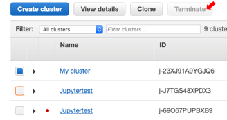

6.  This will bring up the Terminate cluster prompt. Click on “Change”
    to turn off termination protection:

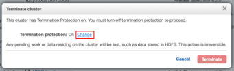

7.  Select Off, then click on the green checkmark and click Terminate:

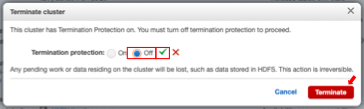

> **Note:** The Amazon EMR console does not let you delete a cluster
> from the list view after you shut down the cluster. A terminated
> cluster disappears from the console when Amazon EMR clears its
> metadata.

#  Empty/delete your S3 bucket

> Full instructions here:
> <https://docs.aws.amazon.com/AmazonS3/latest/userguide/creating-buckets-s3.html>

4.  Sign in to the AWS Management Console and open the Amazon S3 console
    at <https://console.aws.amazon.com/s3/>.

5.  In the Buckets list, select the option next to the name of the
    bucket that you want to delete, and then choose **Empty** or
    **Delete** at the top of the page.

6.  If you are deleting your bucket, confirm that you want to delete the
    bucket by entering the bucket name into the text field, and then
    choose Delete bucket.

**Note:** When you delete a bucket that has S3 Bucket Versioning
enabled, all versions of all the objects in the bucket are permanently
deleted.
