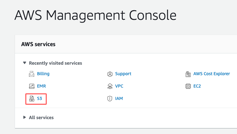
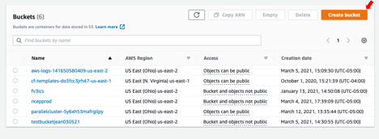
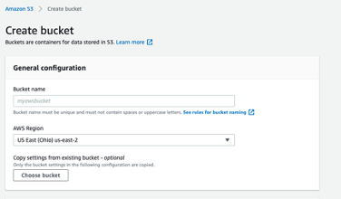
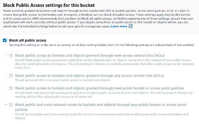
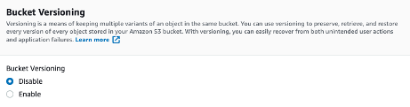

# Creating a bucket for data upload/storage

> Full tutorial:
> <https://docs.aws.amazon.com/AmazonS3/latest/userguide/create-bucket-overview.html>

To upload your data to Amazon S3, you must first create an Amazon S3
bucket in one of the AWS Regions. The AWS account that creates the
bucket owns it. You can upload any number of objects to the bucket.

*  Navigate to the S3 console: <https://console.aws.amazon.com/s3/> or
    click below:

* Click “Create bucket”:

* **Name** your bucket. After you create a bucket, you cannot change
    its name or region.

>* Bucket names must be between 3 and 63 characters long.
>* Bucket names can consist only of lowercase letters, numbers, dots
    (.), and hyphens (-). However, Amazon recommends that dots should be
    avoided.
>* Bucket names must begin and end with a letter or number.
>* More rules at:
    <https://docs.aws.amazon.com/AmazonS3/latest/userguide/bucketnamingrules.html>

* In **Region,** choose an AWS region close to you to minimize latency
    and costs and address regulatory requirements. Objects stored in a
    Region never leave that Region unless you explicitly transfer them
    to another Region.

*  In Bucket settings for Block Public Access, choose the **Block
    Public Access** settings that you want to apply to the bucket. We
    recommend that you keep all settings enabled unless you know that
    you need to turn off one or more of them for your use case, such as
    to host a public website. For more information, see
    <https://docs.aws.amazon.com/AmazonS3/latest/userguide/access-control-block-public-access.html>

* \[Optional but highly recommended\] Enable bucket versioning
    (<https://docs.aws.amazon.com/AmazonS3/latest/userguide/Versioning.html>)

*  Click **Create Bucket**
