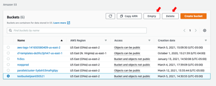
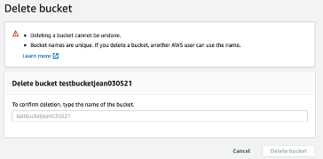

#  Empty/delete your S3 bucket

> Full instructions here:
> <https://docs.aws.amazon.com/AmazonS3/latest/userguide/creating-buckets-s3.html>

* Sign in to the AWS Management Console and open the Amazon S3 console
    at <https://console.aws.amazon.com/s3/>.

* In the Buckets list, select the option next to the name of the
    bucket that you want to delete, and then choose **Empty** or
    **Delete** at the top of the page.

* If you are deleting your bucket, confirm that you want to delete the
    bucket by entering the bucket name into the text field, and then
    choose Delete bucket.

>**Note:** When you delete a bucket that has S3 Bucket Versioning
>enabled, all versions of all the objects in the bucket are permanently
>deleted.
