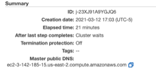

# AWS command line interface (CLI) 

To transfer data between your S3 bucket and Amazon EMR, you will need
to use the **AWS command line interface (CLI)** pre-installed on the
instance.

AWS CLI is a unified tool to manage your AWS services. You can also
download AWS CLI (<https://aws.amazon.com/cli/>) on your local
computer. So, instead of clicking through the web console, you can
perform all actions in this tutorial using the AWS command line
interface (CLI). With just one tool to download and configure, you can
control multiple AWS services from the command line and automate them
through scripts.

##  aws configure 

> Full tutorial:
> <https://docs.aws.amazon.com/cli/latest/userguide/cli-configure-quickstart.html>

When you use AWS CLI for the first time, you will need to set it up using the command `aws configure`. 
When you enter this command, the AWS CLI prompts you for the following information:

* Access key ID and secret access key

If you are a root user, you can create access keys for yourself using
the instructions in the tutorial above. Note that you can only
download the key pair **once**, so keep the information in a secure
place.

* AWS Region

You can get this information from the master public DNS, if you
already have an instance running. In the example below, the region is
**us-east-2**

* Output format

The Default output format specifies how the results are formatted. The
value can be any of the values in the following list. If you don't
specify an output format, json is used as the default.

>   **json** – The output is formatted as a JSON string.

>   **yaml** – The output is formatted as a YAML string. (Available in
    the AWS CLI version 2 only.)

>   **yaml-stream** – The output is streamed and formatted as a YAML
    string. Streaming allows for faster handling of large data types.
    (Available in the AWS CLI version 2 only.)

>   **text** – The output is formatted as multiple lines of
    tab-separated string values. This can be useful to pass the output
    to a text processor, like grep, sed, or awk.

>   **table** – The output is formatted as a table using the characters
    +\|- to form the cell borders. It typically presents the information
    in a "human-friendly" format that is much easier to read than the
    others, but not as programmatically useful.

##  Access files in S3 bucket from an AWS instance 

AWS CLI is useful for backing up data from your AWS instance to a S3
bucket or to transfer files from S3 bucket to your instance. Here is a
list of useful commands you can run after you have set up a SSH
connection to your master node:

*  List all buckets available: `aws s3 ls`

*   List contents of a bucket: `aws s3 ls testbucketjean030521`

*   Copy files from bucket to local machine: `aws s3 cp
    s3://testbucketjean030521/panda.ipynb var/lib/jupyter/home/jovyan/`

*   Copy all files and folders recursively: `aws s3 cp . s3://
    testbucketjean030521 --recursive`

*   Sync a local directory with a bucket. Note that this Sync does not
    copy the existing files and folders from the local machine to the
    bucket. It only copies the files which have been newly created or
    modified: `aws s3 sync . s3:// testbucketjean030521`
