# Creating an EC2 instance

* Navigate to the EC2 console: <https://console.aws.amazon.com/ec2>
    or click below:

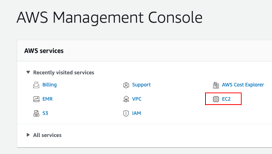

* Choose **Launch instance**

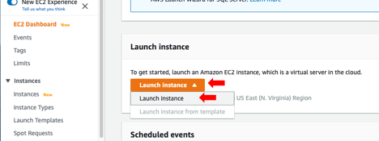

* If you are planning to run a [Docker](https://www.docker.com) container like [Tourmaline](https://github.com/lukenoaa/tourmaline), it is a good idea to
    search for instances with Docker pre-installed. The same goes for
    any other software that you intend to use. Search for **Docker** in
    the search bar, then select any instance that you prefer:

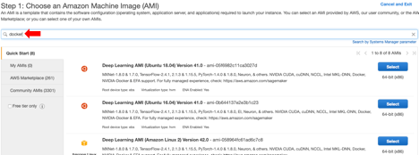

* Choose the instance type, then click Review and Launch.

>**Note:** For bioinformatics analyses (e.g. Tourmaline), t2-nano and
>t2-micro are way too slow and definitely not sufficient. [Here](https://aws.amazon.com/ec2/instance-types/) is a
>detailed list of the CPU, memory, storage and network performance for
>EC2/EMR instances.

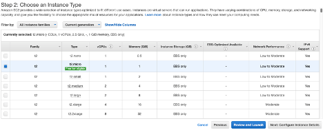

Example specifications. Users can choose from general purpose, compute optimized, memory optimized, accelerated computing (with GPU), and storage optimized instance types.

| Instance   | vCPU\* | CPU Credits / hour | Mem (GiB) |  Storage | Network Performance |
|------------|--------|--------------------|-----------|----------|---------------------|
| t2.nano    |   1    |         3          |    0.5    | EBS-Only | Low                 |
| t2.micro   |   1    |         6          |    1      | EBS-Only | Low to Moderate     |
| t2.small   |   1    |        12          |    2      | EBS-Only | Low to Moderate     |
| t2.medium  |   2    |        24          |    4      | EBS-Only | Low to Moderate     |
| t2.large   |   2    |        36          |    8      | EBS-Only | Low to Moderate     |
| t2.xlarge  |   4    |        54          |    16     | EBS-Only | Moderate            |
| t2.2xlarge |   8    |        81          |    32     | EBS-Only | Moderate            |

*  In the next screen, you can configure your instance, for example,
    you can specify the number of cores and threads and more by checking
    on **Specify CPU options**

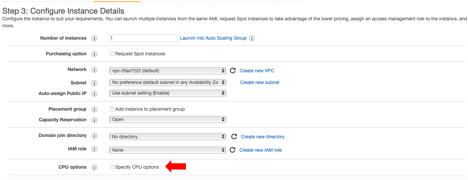

*  In the Specify CPU options window, you can click on the
    Information (i) button to learn more about each option.

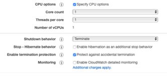

*  You can also configure the **storage device** on the instance. More
    information [here](https://docs.aws.amazon.com/emr/latest/ManagementGuide/emr-plan-storage.html)

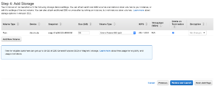

*  \[Optional\]: Add **Tags** to your instance.

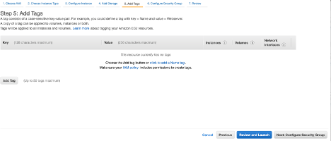

* \[Important\]: **Configure security groups**. By default, the rule
    accepts inbound SSH connections on port 22 from all IP addresses
    (0.0.0.0/0). It is recommended that you change this to restrict SSH
    connections from your IP address only. To do that, click on the Drop
    down menu, then select “**My IP**”. The default address (0.0.0.0/0)
    should be replaced by your IP address. Click “Review and Launch” to
    launch your instance.

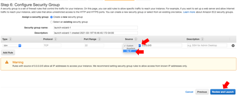

* In the next screen, you will be prompted to select a key pair (instructions at [keypair.MD](https://github.com/shenjean/cloud-classroom/blob/main/keypair.MD)
  or create a new key pair if you haven’t already.

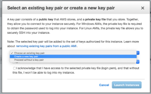

12. If creating a new key pair, you can name your key pair and download
    the key pair, then click “**Launch Instance**”

> It looks like only **pem** key pairs (for OpenSSH in MacOS/Unix
> platforms) can be created and downloaded on the fly when you create an EC2 isntaence. 
> If you are using PuTTY for Windows, Mac, or other OS, you will need the key pair in
> PuTTY’s proprietary **ppk** format – refer to [keypair.MD](https://github.com/shenjean/cloud-classroom/blob/main/keypair.MD)

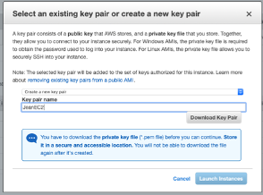

13. Your instance will start and will be ready once the status changes
    to “Running”:

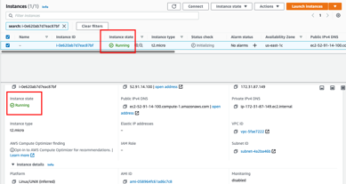

##  Set up a SSH connection to the master node

* You can connect to your instance using SSH to run commands and load
    your docker container. For this, you will need your **keypair file**
    and the appropriate permissions set to it so that only you can read
    the keypair file, e.g.: `chmod 400 keypairname.pem`. If you do not set
    these permissions, you will get an Unprotected Private Key File
    error when connecting to your EC2/EMR instance - see [keypair.MD](https://github.com/shenjean/cloud-classroom/blob/main/keypair.MD)
    
* Login to your **public IPv4 DNS address** as **ec2-user** with your
    **keypair** file:

`ssh -i mykeypair.pem ec2-user@ec2-52-91-14-100.compute-1.amazonaws.com`

Note that the username `ubuntu` is used by Ubuntu instances. Click on your instance ID, then click on the "Connect" button to double-check the username if ec2-user does not work.

`ssh -i mykeypair.pem ubuntu@ec2-52-14-171-214.us-east-2.compute.amazonaws.com`

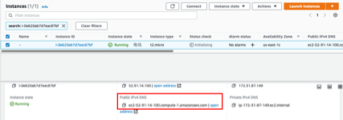

* Type **yes** to respond to the prompt on the ECDSA key fingerprint,
    and you’re in!

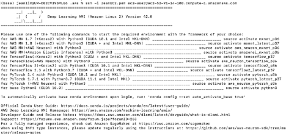

*  Since Docker is already pre-installed, you can just run your Docker
    commands, e.g.

`docker pull aomlomics/tourmaline`

`docker run -v $HOME:/data/ -it aomlomics/tourmaline`

> Make sure your data is backed up – 
> * Refer to [createbucket.MD](https://github.com/shenjean/cloud-classroom/blob/main/createbucket.MD) on how to create a S3 bucket for data storage
> * Refer to [CLI.MD](https://github.com/shenjean/cloud-classroom/blob/main/CLI.MD) on how to copy files to/from your S3 bucket

## Mount SSD volume(s) in an instance

Some [instance types](https://aws.amazon.com/ec2/instance-types/) come with local NVMe-based SSDs that are physically connected to the host server. These SSDs provide block-level storage that is coupled to the lifetime of the instance. For example:

| Instance Size	 | vCPU\*|	Memory (GiB)| Instance Storage (GiB) |	Network Bandwidth (Gbps) |	EBS Bandwidth (Mbps) |
|----------------|-------|--------------|------------------------|---------------------------|-----------------------|
| c6gd.medium	 |  1	 |      2       |   1 x 59 NVMe SSD	     |      Up to 10             |	    Up to 4,750      |
| c6gd.large	 |  2    |      4       |   1 x 118 NVMe SSD     |	    Up to 10             |	    Up to 4,750      |
| c6gd.xlarge	 |  4	 |      8       |   1 x 237 NVMe SSD     |	    Up to 10             |	    Up to 4,750      |
| c6gd.2xlarge   |  8	 |      16      |   1 x 474 NVMe SSD     |	    Up to 10             |	    Up to 4,750      |

## Clean up Amazon EC2 Resources

* If you had enabled **Termination Protection**, you will need to
    disable it before you can terminate your instance. On the EC2
    console, select your instance, then click on **Actions** -&gt;
    **Instance settings** -&gt; **Change termination protection**

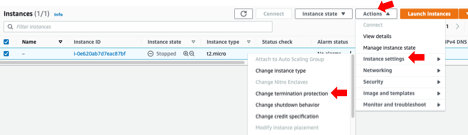

* Uncheck the “enable” checkbox then click Save

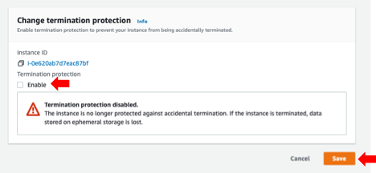

*  Now you can terminate your instance by selecting it, then clicking
    on **Instance state** -&gt; **Terminate Instance**. You can also
    stop, reboot, or hibernate your instance here.

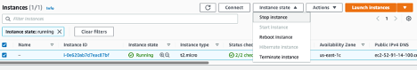

*  This will bring up the Terminate cluster prompt. Click on “Change”
    to turn off termination protection.
 
* You should also empty/delete your designated Amazon S3 bucket to avoid additional charges - see [emptybucket.MD](https://github.com/shenjean/cloud-classroom/blob/main/emptybucket.MD)
