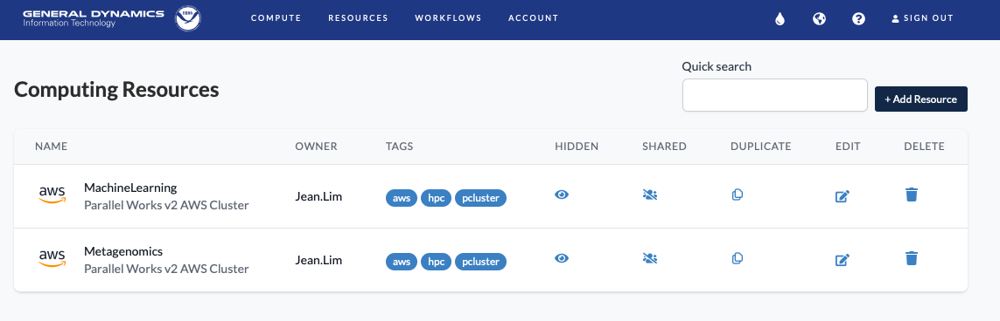
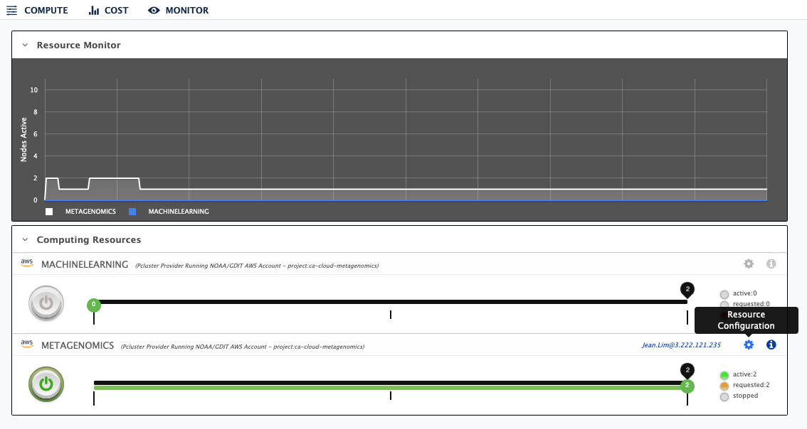

## Configure an AWS Cluster

Before starting a cloud instance, you will have to configure the computing resources needed for that cloud instance. To do that, click on the <b>Resources</b> tab on [Parallel Works](https://noaa.parallel.works/u/resources) then click <b>Add Resource</b> to add a new resource. If you have an existing resource, click <b>Edit</b> to modify the configuration for a specified resource. You can also <b>duplicate</b> your existing resource and make changes to the duplicated resource.



If you already have an existing resource, you can also click on the <b>Resource Configuration</b> gear/settings icon on the <b>Compute</b> tab to open the configuration window. 



| Field  | Description | 
|------------|--------|
| Resource Type | Default: AWS SLURM |
| Resource Account | Select the NOAA account to use for this work |
| Multi Factor | No |
| Jump Node | No |
| Resource Project | Select the project to be charged for this work |
| Multi User | Choose between single user or multiuser cluster type. In a multi-user configuration, all members in a project can access the cluster. Cluster owner shares the master node IP address when it is up. On the right side under the “Settings” menu, there is a “Sharing” icon to share control of your multi-user cluster with the project members. Sharing enhances team collaboration and lets the team manage the cluster in owner’s absence. You can enable sharing before or during the life of a multi-user cluster. Once a multi-user cluster is started, the cluster owner is able to access the cluster from the various locations provided in the cluster’s Access Public Key field. The additional users (guest users) are symlinked from a `/contrib/USER/home` directory. Guest users can place their additional public keys in the `/contrib/USER/home/.ssh/authorized_keys` file to have their public keys propagated and saved to all compute nodes between cluster sessions. It is not possible for interns/non-NOAA users to use the cluster because access to the cloud has the same requirements as those for getting an account on the on-prem systems.  |
| Access Public Key | To access the cloud resource via SSH, you have to copy and paste your public key from the machine used for SSH access. See [here](https://github.com/shenjean/cloud-classroom/blob/main/PW/keygen.MD) for instructions on how to generate a public key |
| User Bootstrap | (optional) User-specific master node bootstrap script - you can use this to automatically execute a set of commands (run with your uid) upon cluster start |
| Restore Configuration |  Restore configuration to default values |
| Region | Must be `us-east-1` |
| Availability zone | Must be `us-east-1c` |
| Controller Instance Type | Choose an instance with the the appropriate memory, vCPUs, and architecture specifications for the controller instance which is used to submit jobs. Note: This is not the actual computing node |
| Controller Image | Default: Latest |
| Image Disk Name |  Select from drop-down menu |
| Image Disk Count |  Specify number of disks for the image [default: 1] |
| Image Disk Size GB | Specify disk size |
| Add Partition | Click on the button to add computing nodes to the instance |
| Name | Specify name of computing node |
| Instance Type | Choose an instance with the the appropriate memory, vCPUs, and architecture specifications for the computing node |
| Max Node Amount | The maximum number of computing nodes with this specification in the cloud instance |
| Default | Yes |
| Enable Spot | Not |
| EFA | Must be disabled |
| Elastic Image | Default: Latest |
| Zone | Must be `us-east-1c` |
| Lustre | The Lustre filesystem is for quick reading and writing of HUGE files (TB scale?). It is very expensive. Do not use unless regular EBS file systems do not meet your needs |
  
Here is a configuration that works

```
{
"architecture":"amd64",
"availability_zone":"us-east-1c",
"controller_image":"latest",
"controller_net_type":false,
"export_fs_type":"xfs",
"image_disk_count":"1",
"image_disk_name":"snap-04f8963f5d94148b6",
"image_disk_size_gb":"5000",
"management_shape":"c5n.2xlarge",
"partition_config":[
        {
        "architecture":"amd64",
        "availability_zone":"us-east-1c",
        "default":"YES",
        "elastic_image":"latest",
        "enable_spot":false,
        "instance_type":"g3.16xlarge",
        "max_node_num":"1",
        "name":"Compute",
        "net_type":false
        }
],
"region":"us-east-1"
}
```


