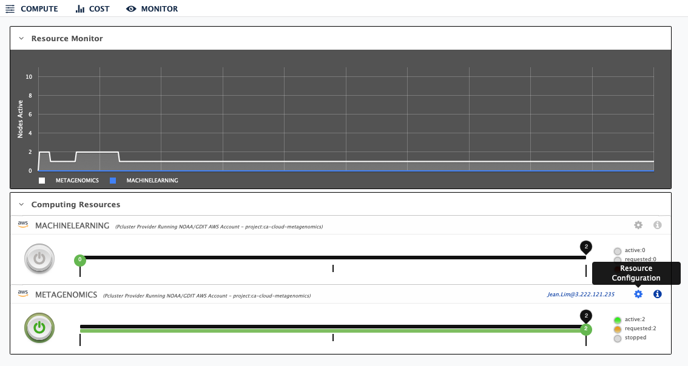

## Start AWS cluster

Once you have [configured your cluster](https://github.com/shenjean/cloud-classroom/blob/main/PW/configure.MD), you can turn it on and off by clicking on the <b>round power button</b> corresponding to your instance name. It may take up to 15 minutes for an AWS cluster to be ready. Once the cluster is up, the "Node Status" bar will turn green up to the first tick indicating that the login node is ready for use. 



### Connecting to the master node via SSH
To get the IP address of the master node, click on the "i" button next to the Resource Configuration button. This opens the "Status" window that displays the IP address to be used to connect to the Master node. Click on the hyperlink next to the "Master node" to copy the IP address.


If you created the cloud instance with your [public key](https://github.com/shenjean/cloud-classroom/blob/main/PW/keygen.MD), you will be able to connect and transfer files to/from the master node without a password. For example:

`ssh username@1.232.141.222`
<br>
`rsync file_to_transfer username@1.232.141.222:/contrib/username/`
<br>
`scp username@1.232.141.222:/contrib/username/file_to_transfer localfilename`

### Connnecting to the master node via Parallel Works IDE environment

You can also use the IDE environment on the Parallel Works website to connect to your cluster. To do this, click on the IDE button on the top right corner of the screen:


From the IDE window, click on Terminal -> New Terminal to start a new Terminal window.


In the Terminal window, ssh into the IP address of the master node to connect. 


You can also upload or download files to the `/pw` directory of IDE environment by clicking on File -> Upload Files.. or File -> Download. Note that this filesystem is separate from the '/contrib' filesystem, so files uploaded will not be available on your cloud instances. They have to be copied over to your instances via `scp` or `rsync`.


### File transfer via AWS-CLI

* AWS command line interface (CLI) can be used to push and pull data from S3 buckets. To use CLI, load the "aws-utils" module: `module load aws-utils/latest`.

* To copy files, `aws s3 cp test.txt s3://mybucket/test2.txt`

### Transient vs permanent storage

Since Parallel Works creates on-demand clusters, all files in the `/home` directory of your instance are transient and will be deleted after the instance is shut down. Files in the `/contrib` volume, however, persists after a cluster is shutdown and can be used from any cloud instance. It is recommended to install common software such as conda and conda environments in the `/contrib/username/home` folder. A conda environment in the `/contrib` folder can be started up from a job script, for example:

```sh
#!/bin/bash
#SBATCH --job-name=CAMISIM      # Job name 
#SBATCH --output=CAMISIM.log     # Standard output and error log    

conda activate /contrib/username/home/miniconda3/envs/CAMISIM
cd /contrib/username/CAMISIM
python metagenomesimulation.py defaults/config.ini
```

### Software and modules

* The AWS instances do not come with software pre-installed, except for Docker and maybe few others. There are pre-installed modules available and you can view or search for modules with the `module avail` or `module spider` command. To load, for example the AWS utility module, you can run `module load aws-utils/latest`.

* The user who created an instance will have sysadmin rights to that instance. This makes it easy to install software system-wide. For example, to install the nano text editor, a user can run `yes | sudo yum install nano`.

* Once miniconda is installed in the `/contrib/user/home` folder, the next time a user starts up another instance, `conda init` can be run to reactivate conda. For example, `/contrib/user/home/miniconda3/bin/conda init`. Remember to restart the login session after running `conda init`. After restarting the session, a user can then run conda commands like `conda activate env_name`.
