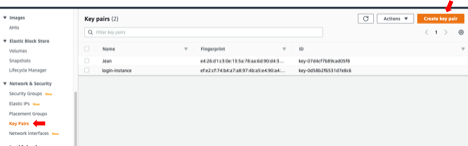
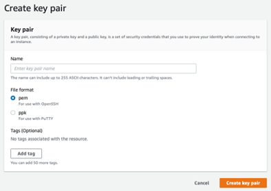
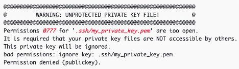

# Creating key pairs to access AWS instances

>Full tutorial:
><https://docs.aws.amazon.com/AWSEC2/latest/UserGuide/ec2-key-pairs.html>

A key pair, consisting of a **public** key and a **private** key, is a
set of security credentials that you use to prove your identity when
connecting to an instance. When your instance boots for the first time,
the content of the public key that you specified at launch is placed on
your Linux instance in an entry within \~/.ssh/authorized\_keys. When
you connect to your instance using SSH, to log in you must specify the
private key that corresponds to the public key content. You use the
private key, instead of a password, to securely access your instances.
If you plan to connect to the instance using SSH, you must specify a key
pair.

* Sign in to the AWS Management Console:
    <https://141650580409.signin.aws.amazon.com/console>

* Navigate to the EC2 console: <https://console.aws.amazon.com/ec2/>
    or click below:

* In the navigation pane, under Network & Security, choose Key Pairs
    and click “**Create key pair**”:

* For **Name**, enter a descriptive name for the key pair. Amazon EC2
    associates the public key with the name that you specify as the key
    name. A key name can include up to 255 ASCII characters. It can’t
    include leading or trailing spaces.

> If you are using PuTTY for Windows, Mac, or other OS, choose **ppk** format. For other SSH clients, **pem** is probably the safer bet.

* For **File format**, choose the format in which to save the private
    key. To save the private key in a format that can be used with
    OpenSSH, choose pem. To save the private key in a format that can be
    used with PuTTY, choose ppk.

* Choose **Create key pair**.

* The private key file is automatically downloaded by your browser.
    The base file name is the name you specified as the name of your key
    pair, and the file name extension is determined by the file format
    you chose. Save the private key file in a safe place.

> Important: **This is the only chance for you to save the private key file**.

* If you will use an SSH client on a macOS or Linux computer to
    connect to your Linux instance, use the following command to set the
    permissions of your private key file so that only you can read it,
    e.g.: `chmod 400 keypairname.pem`

> If you do not set these permissions, then you will get the following
> error when connecting to your EC2/EMR instance:
>
> 

> Other connection errors can be troubleshooted here:
> <https://docs.aws.amazon.com/AWSEC2/latest/UserGuide/TroubleshootingInstancesConnecting.html#troubleshoot-unprotected-key>
